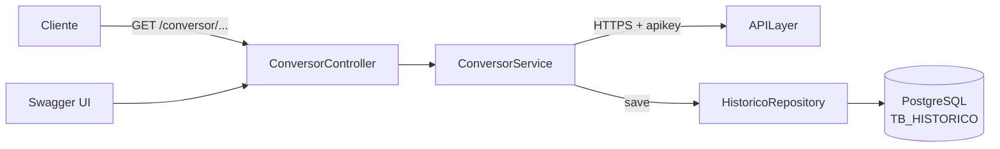

<div align="center">

# 💱 Conversor de Moedas

**API REST para conversão de moedas, consulta de taxas atuais e registro do histórico em PostgreSQL.**

[](https://openjdk.org/)
[](https://spring.io/projects/spring-boot)
[](https://www.postgresql.org/)
[](https://maven.apache.org/)
[](https://springfox.github.io/springfox/)

[Visão geral](#visão-geral) · [Arquitetura](#arquitetura) · [API](#api) · [Configuração](#configuração) · [Testes](#testes-e-build) · [Avaliação técnica](#avaliação-técnica)

</div>

---

## Visão geral

O projeto é uma API REST enxuta que resolve um fluxo simples:

> **Receber valor e moedas → consultar a taxa na APILayer → converter → salvar no banco → retornar a resposta.**

Ele funciona como um MVP funcional para estudo e demonstração de uma arquitetura Spring Boot em camadas.

### O que o sistema oferece

| Capacidade | Implementação |
|---|---|
| Conversão de valores | Moeda de origem e destino informadas no endpoint |
| Taxas atuais | Integração externa com a APILayer |
| Moedas disponíveis | Nove moedas definidas em um `enum` |
| Persistência | Cada conversão bem-sucedida é gravada no PostgreSQL |
| Documentação interativa | Interface Swagger UI |
| Acesso por frontends | CORS liberado para todas as origens |
| Build reproduzível | Maven Wrapper incluído no projeto |

### Escopo atual

- ✅ Converter valores entre moedas suportadas.
- ✅ Registrar dados básicos da conversão.
- ✅ Expor um endpoint REST documentado.
- ❌ Consultar o histórico pela API.
- ❌ Autenticar usuários ou proteger a API.
- ❌ Aplicar cache, timeout ou retry na integração externa.
- ❌ Disponibilizar uma interface web própria.

---

## Stack

| Tecnologia | Versão/uso |
|---|---|
| Java | 17 |
| Spring Boot | 2.7.5 |
| Spring Web | Exposição dos endpoints REST |
| Spring Data JPA / Hibernate | Persistência do histórico |
| PostgreSQL | Banco de dados relacional |
| Java `HttpClient` | Comunicação com a APILayer |
| Springfox | Documentação Swagger 2.0 |
| JUnit 5 | Teste automatizado |
| Maven Wrapper | Build sem necessidade de instalar o Maven |

---

## Arquitetura

O projeto utiliza uma arquitetura em camadas, na qual cada componente possui uma responsabilidade específica.



### Componentes

| Camada | Classe | Responsabilidade |
|---|---|---|
| Controller | `ConversorController` | Receber a requisição e converter os códigos das moedas |
| Serviço | `ConversorService` | Chamar a APILayer, obter o resultado e persistir o histórico |
| Repositório | `HistoricoRepository` | Executar as operações JPA na tabela de histórico |
| Entidade | `HistoricoModel` | Representar os dados armazenados em `TB_HISTORICO` |
| Domínio | `CodeCoin` | Limitar as moedas aceitas pela API |
| Configuração | `SwaggerConfiguration` | Publicar a documentação da API |

### Fluxo de uma conversão

1. O cliente chama `GET /conversor/{valor}/{moeda}/{moedaParaConverter}`.
2. O Spring converte os segmentos da URL para `Double` e `CodeCoin`.
3. O serviço envia uma requisição HTTPS para a APILayer com `from`, `to` e `amount`.
4. O campo `result` da resposta é utilizado para montar o registro de histórico.
5. O registro é salvo pelo `HistoricoRepository`.
6. O corpo original da resposta da APILayer é devolvido ao cliente.

---

## Moedas suportadas

| Código | Moeda |
|---|---|
| `AUD` | Dólar australiano |
| `CAD` | Dólar canadense |
| `CHF` | Franco suíço |
| `CNY` | Iuane chinês |
| `GBP` | Libra esterlina |
| `JPY` | Iene japonês |
| `USD` | Dólar americano |
| `EUR` | Euro |
| `BRL` | Real brasileiro |

> Os códigos são enviados em letras maiúsculas e precisam corresponder a um item do `enum CodeCoin`.

---

## API

### Converter moedas

```http
GET /conversor/{valor}/{moeda}/{moedaParaConverter}
```

#### Parâmetros

| Parâmetro | Formato | Exemplo | Descrição |
|---|---|---|---|
| `valor` | `Double` | `100.00` | Valor a ser convertido; use ponto como separador decimal |
| `moeda` | `CodeCoin` | `USD` | Moeda de origem |
| `moedaParaConverter` | `CodeCoin` | `BRL` | Moeda de destino |

## Conclusão

O projeto entrega um MVP claro e demonstrável de conversão de moedas, integrando uma API externa, persistência em banco e documentação interativa. A arquitetura é simples de entender e fácil de executar, mas ainda deve ser preparada para produção com gestão segura de configuração, tratamento de erros, tipos monetários e uma suíte de testes mais completa.
